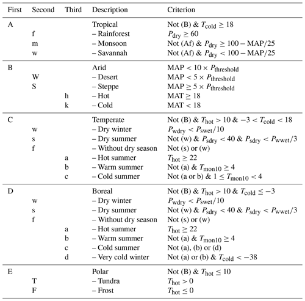

This repo contains materials (slides, data, and a notebook) prepared for the LEAP workshop on July 24, 2025.

Author: Viviana Acquaviva (2025)

License: [BSD-3-clause](https://opensource.org/license/bsd-3-clause/)

The data come from 

http://glass.umd.edu/KGClim/

and are based on the maps provided by Cui et al 2021 (https://essd.copernicus.org/articles/13/5087/2021/)

The goal of this exercise is to check whether we can reproduce the mapping of the Koppen-Geiger climate zones by using a random subset of a KG climate map as a training set. In short, we would like to use a Decision Tree to reproduce these behaviors (from Cui et al 2021).

The input features we consider are the annual mean temperature (Tavg), the temperature of the warmest (Twm) and coldest month (Tcm), the annual precipitation (Ptot), and the precipitation in the wettest (Pwm) and driest month(Pdm).

The target is the Koppen-Geiger class, but we group them in 5 classes (A, B, C, D, E) instead of considering subclasses.
